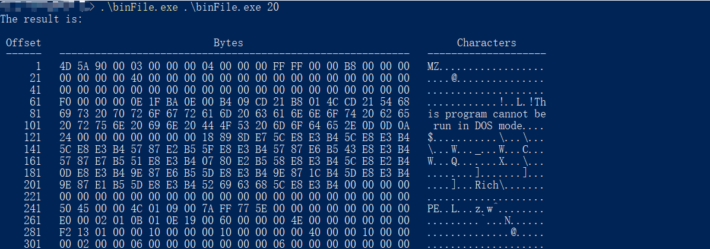

# 第二讲 概览

从头开始介绍一门编程语言总是让我们感到乏味，海潮般的细节会将自身淹没，磨灭学习的兴趣。因此，在本章中，我将会向大家展示一个示例程序，并逐行讲解C语言的工作流程，希望读者能够对C语言有一个整体的认识。

我们要浏览的这个程序能够将任意文件以十六进制格式化地输出到屏幕中，它通过`CMD`获取目标文件的路径以及每行输出的宽度，然后在`CMD`中输出：

CMD中输入的内容：
`./binFile.exe /your/file/path`

如果我们想看看一个`HelloWorld.c`文件是怎样被输出的，就在`/your/file/path`中填入它的路径，输出的结果如下，是不是很酷？


> Offset：偏移量；Bytes：字节；Characters：字符

我们可以看到，输入编译好的文件名`binFile.exe`，加上指定的参数，就能够以一种全新的方式审视文件。不只是像`.c`、`.txt`、`.doc`之类的文档，这个C语言程序还能让我们一睹 `.exe`文件的风采！




对于第一个文件`HelloWorld_test.c`来说，左侧的偏移量显示了每行开头字节的位置，中间是十六进制显示的字节，而右侧则是我们实际看到的字符串，它是这样的：

```c
#include <stdio.h>

int main(void){
    printf("Hello World!\n");
    return 0;
}
```


事实上，我们可以用不到 100 行的程序实现这样一个非常酷的功能。程序及注释如下，暂不熟悉C语言的读者不必仔细阅读，经过数月的训练，你们也能轻松写出这样的程序。

```c
/*
** binFile.c
**
** 本程序将任意可读文件以十六进制打印出全部内容，并打印出对应的可打印字符。
** 
** 终端（CMD、PowerShell等）中输入：binFile.exe <File_Path> <Width>
** File_Path: 需要打印的文件的路径
** Width: 一行打印的字节数
** 
** 输出：见上方图像
*/

#include <stdio.h>
#include <stdlib.h>
#include <assert.h>
#include <ctype.h>
#include <io.h>

// 宏定义一个常量 
#define LEN 1000

// 函数原型，可忽略参数名 
void binFile(char [LEN], int);
/* 
** main函数，程序执行的入口
** argc用来接收从CMD中传入的参数的数量 
** argv用来存储传入的参数
*/
int main(int argc, char *argv[]){
	// 传入参数的数量不为2（默认会多传入一个可执行文件的目录） 
	if(argc != 3){
		// 以字符串形式输出错误信息 
		printf("usage: %s operation_name file_path offsset_num\n", argv[0]);
		// 返回错误信息 
		exit(EXIT_FAILURE);
	}
	// 正确传入参数，执行binFile函数 
	else{
		printf("The result is: \n\n");
		/* 
		** 根据函数原型的参数类型，传入对应类型的参数
		** atoi()函数将以字符串形式储存的数字转化为整型 
		*/
		binFile(argv[1], atoi(argv[2]));
		// 程序运行正常，返回一个特定值 
		return 0;
	}
}

// binFile函数的主体 
void binFile(char filepath[LEN], int offset){
	/* 
	** 断言，检查目标文件是否可以被读取
	** 若不可读取，则直接退出整个程序 
	*/
	assert(access(filepath, 4) == 0);

	int i, j, n;
	// 动态定义一个unsigned char类型的数组，长度为offset 
	unsigned char *temp = (unsigned char *)malloc(sizeof(unsigned char) * offset);
	// 置空temp数组，以便填充内容 
	for(i=0;i<offset+1;i++) temp[i] = '\0';
	// 打开目标文件，获得一个文件结构体指针 
	FILE *fp = fopen(filepath, "rb");
	
	// 按照格式输出表头 
	printf(" Offset  %*sBytes%*s   %*sCharacters%*s\n", \
		(int)((3*offset-6)/2), " ", (int)((3*offset-6)/2), " ",\
		(int)((offset-10)/2+1), " ", (int)((offset-10)/2), " ");
	// 按照格式输出一行分隔符 
	printf(" ------   ");
	for(i=0;i<(3*offset-1);i++) printf("%c", '-');
	printf("   ");
	for(i=0;i<offset;i++) printf("%c", '-');
	printf("\n");
	
	j = 0;
	// 不断循环获取一定长度的文件内容 
	while(1){
		// 使用获得的文件指针从文件起始处读取指定长度的数据 
		n = fread(temp, sizeof(unsigned char), offset, fp);
		// 输出指定长度的空格，以对齐表头 
		printf("  %5d", offset * j + 1);
		j++;
		printf("   ");
		// 按照大写、十六进制的格式输出获取到的文件内容 
		for(i=0;i<n;i++){
			if(i == 0) printf("%02X", temp[i]);
			else printf(" %02X", temp[i]);
		}
		// 如果获取到的n个字符少于我们规定的每行宽度 
		if(n < offset){
			for(i=n;i<offset;i++) printf("   ");
		}
		printf("   ");
		// 根据字符是否可被打印，按照字符格式输出 
		for(i=0;i<n;i++){
			if(isprint(temp[i]) == 0) printf(".");
			else printf("%c", temp[i]);
		}
		printf("\n");
		// 置空temp数组，以便下个循环填充 
		for(i=0;i<offset+1;i++) temp[i] = '\0';
		/* 
		** 如果获取的文件内容长度小于设定的宽度
		** 说明已经到达文件末尾，跳出循环
        */
		if(n < offset) break;
	}
	
	// 释放动态分配的temp的内存 
	free(temp);
	// 关闭文件指针 
	fclose(fp);
}
```


## 空白与注释

让我们先仔细看看这个程序。在繁多的字符中，相信程序的空白是你首先注意到的。C语言并不是像Python那样，有着严格的格式要求，但是遵守一定的规范来书写程序不仅有助于我们整理思路，还易于阅读和维护。一般来说，我们使用空行分隔不同功能的代码块，使用换行分开不同的语句，使用制表符（Tab）缩进语句，以显示出代码清晰的结构。

但是，只有清晰的结构还不够。当你一个星期、一个月后再次阅读你的程序，你还能清楚地知道你写的代码是什么意思吗？也许你有精力去理解几十行的代码，那几百行、几千行代码又该如何呢？或者说，别人怎样轻易理解你的程序呢？

所以，我们需要**注释**（comment）来告诉阅读程序的人，这一个程序能干什么以及它是怎样做的。

```c
/*
** binFile.c
**
** 本程序将任意可读文件以十六进制打印出全部内容，并打印出对应的可打印字符。
** 
** 终端（CMD、PowerShell等）中输入：binFile.exe <File_Path> <Width>
** File_Path: 需要打印的文件的路径
** Width: 一行打印的字节数
** 
** 输出：见上方图像
*/
```

**多行注释**以`/*`开始，结束于`*/`，中间的所有内容都将被视为注释；**单行注释**以`//`开始，从`//`一直到该行的换行符，中间都为注释。

> 注意：单行注释从`c99`标准开始引入，如果选择了`c90`标准编译，则单行注释会出错。


需要注意的是，多行注释不可嵌套。有时你会想用多行注释将一段代码注释掉，使其不发挥作用，但这样做是危险的，如果想要注释的代码中包含多行注释，就会出错。

```c
/* 
/* 内部的多行注释 */
printf("123\n");
*/
```

像上面这样，嵌套使用多行注释是无法把语句从程序中去除的。

> *Why?*
>
> 想要了解更多细节，可以阅读《C陷阱与缺陷》1.3节。


