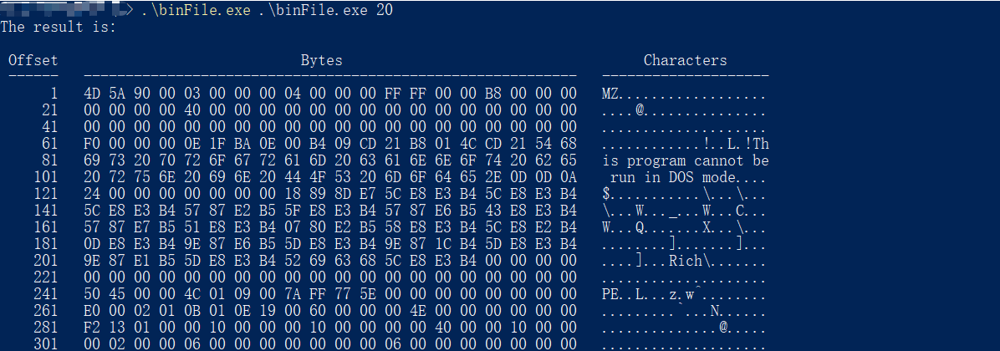

# 第二讲 概览

*Author: GEEKSORG*

从头开始介绍一门编程语言总是让我们感到乏味，海潮般的细节会将自身淹没，磨灭学习的兴趣。因此，在本章中，我将会向大家展示一个示例程序，并逐行讲解C语言的工作流程，希望读者能够对C语言程序有一个整体的认识。

我们要浏览的这个程序能够将任意文件以十六进制格式化地输出到屏幕中，它通过`CMD`获取目标文件的路径以及每行输出的宽度，然后在`CMD`中输出：

CMD中输入的内容：
`./binFile.exe /your/file/path`

如果我们想看看一个`HelloWorld.c`文件是怎样被输出的，就在`/your/file/path`中填入它的路径，输出的结果如下，是不是很酷？


> Offset：偏移量；Bytes：字节；Characters：字符

我们可以看到，输入编译好的文件名`binFile.exe`，加上指定的参数，就能够以一种全新的方式审视文件。不只是像`.c`、`.txt`、`.doc`之类的文档，这个C语言程序还能让我们一睹 `.exe`文件的风采！




对于第一个文件`HelloWorld_test.c`来说，左侧的偏移量显示了每行开头字节的位置，中间是十六进制显示的字节，而右侧则是我们实际看到的字符串，它是这样的：

```c
/* Program 7.1 */
#include <stdio.h>

int main(void){
    printf("Hello World!\n");
    return 0;
}
```


事实上，我们可以用不到 100 行的程序实现这样一个非常酷的功能。程序及注释如下，暂不熟悉C语言的读者不必仔细阅读，经过数月的训练，你们也能轻松写出这样的程序。

```c
/* Program 7.2 */
/*
** binFile.c
**
** 本程序将任意可读文件以十六进制打印出全部内容，并打印出对应的可打印字符。
** 
** 终端（CMD、PowerShell等）中输入：binFile.exe <File_Path> <Width>
** File_Path: 需要打印的文件的路径
** Width: 一行打印的字节数
** 
** 输出：见上方图像
*/

#include <stdio.h>
#include <stdlib.h>
#include <assert.h>
#include <ctype.h>
#include <io.h>
// 宏定义一个常量 
#define LEN 1000

/* 
** 函数原型，可忽略参数名
*/
void binFile(char [LEN], int);

/* 
** main函数，程序执行的入口
** argc用来接收从CMD中传入的参数的数量 
** argv用来存储传入的参数
*/
int main(int argc, char *argv[]){
	// 传入参数的数量不为2（默认会多传入一个可执行文件的目录） 
	if(argc != 3){
		// 以字符串形式输出错误信息 
		printf("usage: %s operation_name file_path offsset_num\n", argv[0]);
		// 返回错误信息 
		exit(EXIT_FAILURE);
	}
	// 正确传入参数，执行binFile函数 
	else{
		printf("The result is: \n\n");
		// 根据函数原型的参数类型，传入对应类型的参数
		// atoi()函数将以字符串形式储存的数字转化为整型 
		binFile(argv[1], atoi(argv[2]));
		// 程序运行正常，返回一个特定值 
		return 0;
	}
}

/* 
** binFile函数的主体
*/
void binFile(char filepath[LEN], int offset){
	// 断言，检查目标文件是否可以被读取
	// 若不可读取，则直接退出整个程序 
	assert(access(filepath, 4) == 0);

	int i, j, n;
	// 动态定义一个unsigned char类型的数组，长度为offset 
	unsigned char *temp = (unsigned char *)malloc(sizeof(unsigned char) * offset);
	// 置空temp数组，以便填充内容 
	for(i=0;i<offset+1;i++) temp[i] = '\0';
	// 打开目标文件，获得一个文件结构体指针 
	FILE *fp = fopen(filepath, "rb");
	
	// 按照格式输出表头 
	printf(" Offset  %*sBytes%*s   %*sCharacters%*s\n", \
		(int)((3*offset-6)/2), " ", (int)((3*offset-6)/2), " ",\
		(int)((offset-10)/2+1), " ", (int)((offset-10)/2), " ");
	// 按照格式输出一行分隔符 
	printf(" ------   ");
	for(i=0;i<(3*offset-1);i++) printf("%c", '-');
	printf("   ");
	for(i=0;i<offset;i++) printf("%c", '-');
	printf("\n");
	
	j = 0;
	// 不断循环获取一定长度的文件内容 
	while(1){
		// 使用获得的文件指针从文件起始处读取指定长度的数据 
		n = fread(temp, sizeof(unsigned char), offset, fp);
		// 输出指定长度的空格，以对齐表头 
		printf("  %5d", offset * j + 1);
		j++;
		printf("   ");
		// 按照大写、十六进制的格式输出获取到的文件内容 
		for(i=0;i<n;i++){
			if(i == 0) printf("%02X", temp[i]);
			else printf(" %02X", temp[i]);
		}
		// 如果获取到的n个字符少于我们规定的每行宽度 
		if(n < offset){
			for(i=n;i<offset;i++) printf("   ");
		}
		printf("   ");
		// 根据字符是否可被打印，按照字符格式输出 
		for(i=0;i<n;i++){
			if(isprint(temp[i]) == 0) printf(".");
			else printf("%c", temp[i]);
		}
		printf("\n");
		// 置空temp数组，以便下个循环填充 
		for(i=0;i<offset+1;i++) temp[i] = '\0';
		/* 
		** 如果获取的文件内容长度小于设定的宽度
		** 说明已经到达文件末尾，跳出循环
        */
		if(n < offset) break;
	}
	
	// 释放动态分配的temp的内存 
	free(temp);
	// 关闭文件指针 
	fclose(fp);
}
```


## 空白与注释

让我们先仔细看看这个程序。在繁多的字符中，相信程序的空白是你首先注意到的。C语言并不是像Python那样，有着严格的格式要求，但是遵守一定的规范来书写程序不仅有助于我们整理思路，还易于阅读和维护。一般来说，我们使用空行分隔不同功能的代码块，使用换行分开不同的语句，使用制表符（Tab）缩进语句，以显示出代码清晰的结构。

但是，只有清晰的结构还不够。当你一个星期、一个月后再次阅读你的程序，你还能清楚地知道你写的代码是什么意思吗？也许你有精力去理解几十行的代码，那几百行、几千行代码又该如何呢？或者说，别人怎样轻易理解你的程序呢？

所以，我们需要**注释**（comment）来告诉阅读程序的人，这一个程序能干什么以及它是怎样做的。

```c
/*
** binFile.c
**
** 本程序将任意可读文件以十六进制打印出全部内容，并打印出对应的可打印字符。
** 
** 终端（CMD、PowerShell等）中输入：binFile.exe <File_Path> <Width>
** File_Path: 需要打印的文件的路径
** Width: 一行打印的字节数
** 
** 输出：见上方图像
*/
```

**多行注释**以`/*`开始，结束于`*/`，中间的所有内容都将被视为注释；**单行注释**以`//`开始，从`//`一直到该行的换行符，中间都为注释。

> 注意：单行注释从`c99`标准开始引入，如果选择了`c90`标准编译，则单行注释会出错。


需要注意的是，多行注释不可嵌套。有时你会想用多行注释将一段代码注释掉，使其不发挥作用，但这样做是危险的，如果想要注释的代码中包含多行注释，就会出错。

```c
/* 
/* 内部的多行注释 */
printf("123\n");
*/
```

像上面这样，嵌套使用多行注释是无法把语句从程序中去除的。

> *Why?*
>
> 想要了解更多细节，可以阅读《C陷阱与缺陷》1.3节。


## 预处理命令

```c
#include <stdio.h>
#include <stdlib.h>
#include <assert.h>
#include <ctype.h>
#include <io.h>
// 宏定义一个常量 
#define LEN 1000
```

上面的代码被称为**预处理命令**。之所以被称为“预处理”，是因为它们在程序编译之前，由**预处理器**解释并修改源代码。例如：

```c
#include <stdio.h>
```

表示将`stdio.h`文件的内容引入本程序，预处理器将用`stdio.h`文件的内容替换这一行。

```c
#define LEN 1000
```

这一行表示把变量名`LEN`定义为1000，预处理时，程序中的所有`LEN`将被替换为数值1000。

> `stdio.h`让我们可以使用键盘输入和屏幕输出的函数；`stdlib.h`包含了`atoi()`等常用的函数；`assert.h`用于在代码运行前验证一些必要的事情，比如打开文件前确认文件是否可读。


## 函数原型

```c
// 函数原型，可忽略参数名 
void binFile(char [LEN], int);
```

上述语句被称为**函数原型**。“原型”一词表示它具有函数的一些关键特征，比如函数的名字、返回什么类型的数据以及参数是什么类型。它的作用是让我们先规定这个函数叫什么、输入的参数以及输出的数据是什么类型，然后在我们定义了函数具体做什么后，让编译器检查这个函数是否符合我们的规定。

函数原型以函数返回值的类型开头，然后是函数名、函数接收的参数。`void`表示“空”，说明这个函数没有返回任何数据；`binFile`是函数的名字；`char [LEN]`表示函数接收一个字符类型的数组；`int`表示函数还接收一个`int`类型的变量。

在函数原型的定义中，参数的名字是不必要的。函数就像一个”白盒“，我们关注的是参与运算的数据是什么，而不是叫什么。


## `main`函数

```c
int main(void)
```

上述代码是`main`函数的起始部分，`void`表示不接收参数。如果你想在终端（CMD、PowerShell等）中以`<命令> <参数1> <参数2> ......`的形式运行程序，则可参考我们的示例程序。

**作为程序的起点，任何一个C语言程序有且仅有一个`main`函数。**


## 花括号、函数体与代码块

```c
{
......
}
```

从示例程序中可以看到，所有的函数语句都位于花括号`{}`内，称为**函数体**；一些语句也位于花括号内，形成一个**代码块**。


## 声明与赋值

```c
int i, j, n;
j = 0;
```

第一行声明了3个变量：`i`、`j`、`n`。**声明**的意思是：定义了名字为`i`、`j`、`n`的**变量**，并且给变量指定了**数据类型**。在接下来的章节中，将会详细介绍变量的命名以及各种数据类型。

第二行叫做**赋值表达式语句**，意思是“将变量`j`的值修改为数值0”。需要注意的是，该表达式将等号右侧的值赋给右侧的变量，不能写成`0 = j`。另外，赋值表达式语句以英文分号`;`结尾。


## `printf()`函数

```c
printf("Hello World!\n");
printf("usage: %s operation_name file_path offsset_num\n", argv[0]);
```

这两个语句使用了C语言的一个内置的函数`printf()`，能够将双引号`“”`中的内容打印到屏幕上。其中，`printf`是函数的名字，`()`圆括号内是这个函数正确运行所必要的信息，我们叫它**参数**。具体来说，在我们设计一个函数时，会用一个或多个“名字”代指告诉函数的信息，这样的“名字”叫做**形式参数**；而我们具体应用时，需要告诉函数具体的信息，这样的信息叫做**实际参数**。

`printf()`函数位于**头文件**`stdio.h`中，因此需要使用预处理命令引入。


## `return`语句

```c
return 0;
```

对于我们定义的`main()`函数来说，`int main()`表示该函数**应该**返回一个`int`类型的值。该语句以`return`关键字开头，后接需要返回的值，最后以分号结尾。很多时候你会发现，你的`main()`函数其实不需要具有返回值，但是还是建议写成`int main()`并且在函数末尾加上`return 0;`，你能用它来发现，程序是正常执行还是具有一些错误。另外，如果你在`Unix`或`Linux`上编译运行，有时候`return 0;`将具有特别的含义。


## 总结

让我们回顾一下C语言程序的大致结构：

```c
// 一个C语言程序由一个或多个函数组成
// 必须存在main()函数
// 函数的格式为：<返回值类型> <函数名> ( <传入的参数> ) {......}

// ******************** 引入需要的头文件 ********************
#include <stdio.h>
// *******************************************************

// ************************ 函数头 ************************
int main(void)
// *******************************************************

// ************************ 函数体 ************************
{
    int i;
    i = 0;
    printf("%d, Hello World!\n", i);
    return 0;
}
// *******************************************************
```

那么，我们如何写好一个程序呢？

1. 构思解决问题的方法。我们需要知道我们要做什么，怎样做，需要提供什么信息，需要获得什么信息等。
2. 设计程序。这一步是将我们的思考成果转化成代码表达出来。我们可能需要考虑怎样简单地表示和处理数据等。
3. 编译运行。将源代码转换成机器可以直接执行的程序，然后运行。具体的内容将在==之后的章节（需指明）==中介绍。
4. 调试和修改。一步完成当然是值得庆祝的好事，但现实往往并并不是那样。查找并修复程序错误的过程叫做**调试**。当你调试完成，又想扩展程序的用途、优化解决问题的流程时，就需要对程序进行修改。这是一个循环往复的过程，你将一步一步地把自己的程序打磨成满意的模样。


