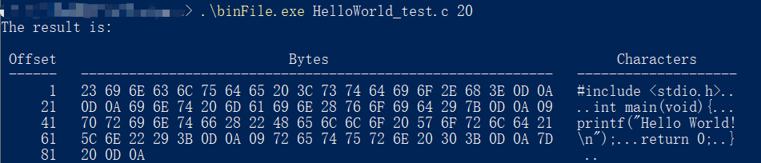

# 第二讲 概览

从头开始介绍一门编程语言总是让我们感到乏味，海潮般的细节会将自身淹没，磨灭学习的兴趣。因此，在本章中，我将会向大家展示一个示例程序，并逐行讲解C语言的工作流程，希望读者能够对C语言有一个整体的认识。

我们要浏览的这个程序能够将任意文件以十六进制格式化地输出到屏幕中，它通过`CMD`获取目标文件的路径以及每行输出的宽度，然后在`CMD`中输出：

CMD中输入的内容：
`./binFile.exe /your/file/path`

如果我们想看看一个`HelloWorld.c`文件是输出的，就在`/your/file/path`中填入它的路径，输出的结果如下，是不是很酷？



> Offset：偏移量；Bytes：字节；Characters：字符

我们可以看到，输入编译好的文件名`binFile.exe`，加上目标文件的路径`HelloWorld_test.c`和选定的每行宽度，就输出了结果。左侧的偏移量显示了每行开头字节的位置，中间是十六进制显示的字节，右侧是我们实际看到的字符串，它是这样的：

```c
#include <stdio.h>

int main(void){
    printf("Hello World!\n");
    return 0;
}
```

让我们来看看这个程序：

```c
#include <stdio.h>
#include <stdlib.h>
#include <assert.h>
#include <ctype.h>
#include <io.h>

// 宏定义一个常量 
#define LEN 1000

// 函数原型，可忽略参数名 
void binFile(char [LEN], int);
// main函数，程序执行的入口
// argc用来接收从CMD中传入的参数的数量 
// argv是指针的数组，用来存储传入的参数 
int main(int argc, char *argv[]){
	// 传入参数的数量不为2（默认会多传入一个可执行文件的目录） 
	if(argc != 3){
		// 以字符串形式输出错误信息 
		printf("usage: %s operation_name file_path offsset_num\n", argv[0]);
		// 返回错误信息 
		exit(EXIT_FAILURE);
	}
	// 正确传入参数，执行binFile函数 
	else{
		printf("The result is: \n\n");
		// 根据函数原型的参数类型，传入对应类型的参数
		// atoi()函数将以字符串形式储存的数字转化为整型 
		binFile(argv[1], atoi(argv[2]));
		// 程序运行正常，返回一个特定值 
		return 0;
	}
}

// binFile函数的主体 
void binFile(char filename[LEN], int offset){
	// 断言，检查目标文件是否可以被读取
	// 若不可读取，则直接退出整个程序 
	assert(access(filename, 4) == 0);

	int i, j, n;
	// 动态定义一个unsigned char类型的数组，长度为offset 
	unsigned char *temp = (unsigned char *)malloc(sizeof(unsigned char) * offset);
	// 置空temp数组，以便填充内容 
	for(i=0;i<offset+1;i++) temp[i] = '\0';
	// 打开目标文件，获得一个文件结构体指针 
	FILE *fp = fopen(filename, "rb");
	
	// 按照格式输出表头 
	printf(" Offset  %*sBytes%*s   %*sCharacters%*s\n", \
		(int)((3*offset-6)/2), " ", (int)((3*offset-6)/2), " ",\
		(int)((offset-10)/2+1), " ", (int)((offset-10)/2), " ");
	// 按照格式输出一行分隔符 
	printf(" ------   ");
	for(i=0;i<(3*offset-1);i++) printf("%c", '-');
	printf("   ");
	for(i=0;i<offset;i++) printf("%c", '-');
	printf("\n");
	
	j = 0;
	// 不断循环获取一定长度的文件内容 
	while(1){
		// 使用获得的文件指针从文件起始处读取指定长度的数据 
		n = fread(temp, sizeof(unsigned char), offset, fp);
		// 输出指定长度的空格，以对齐表头 
		printf("  %5d", offset * j + 1);
		j++;
		printf("   ");
		// 按照大写、十六进制的格式输出获取到的文件内容 
		for(i=0;i<n;i++){
			if(i == 0) printf("%02X", temp[i]);
			else printf(" %02X", temp[i]);
		}
		// 如果获取到的n个字符少于我们规定的每行宽度 
		if(n < offset){
			for(i=n;i<offset;i++) printf("   ");
		}
		printf("   ");
		// 根据字符是否可被打印，按照字符格式输出 
		for(i=0;i<n;i++){
			if(isprint(temp[i]) == 0) printf(".");
			else printf("%c", temp[i]);
		}
		printf("\n");
		// 置空temp数组，以便下个循环填充 
		for(i=0;i<offset+1;i++) temp[i] = '\0';
		// 如果获取的文件内容长度小于设定的宽度
		// 说明已经到达文件末尾，跳出循环 
		if(n < offset) break;
	}
	
	// 释放动态分配的temp的内存 
	free(temp);
	// 关闭文件指针 
	fclose(fp);
}
```

